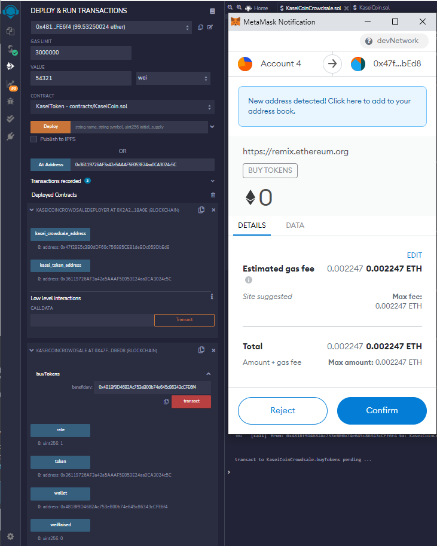
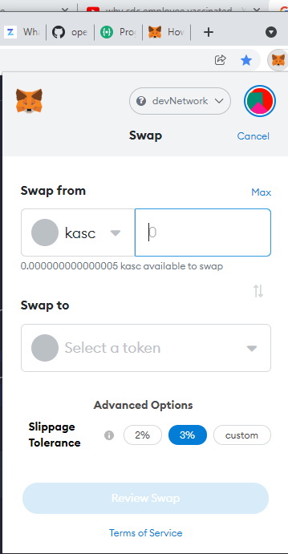
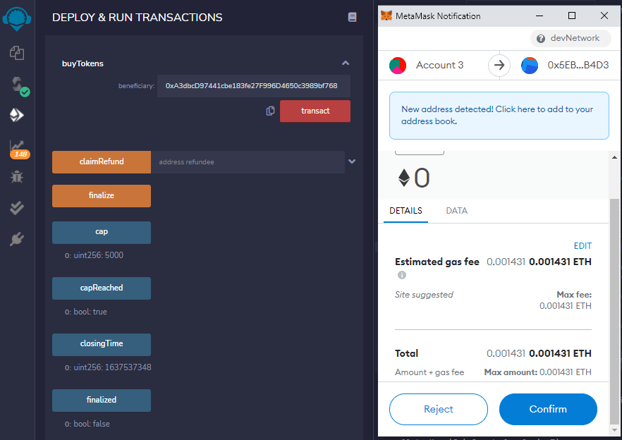

# Berkeley Fintech Module 21 Challenge

Setup a new fungible ERC-20 compliant cryptocurrency KaseiCoin in solidity.
Mint the fungible token using a timed and capped crowdsale to sell the tokens.

## Evaluation Evidence 
### Solidity Compiler - Compiled KaseiCoin

### Solidity Compiler - Compiled KaseiCoinCrowdsale

### Solidity Compiler - Compiled KaseiCoinCrowdsaleDeployer


## Use the KaseiCoinCrowdsaleDeployer to deploy the KaseiCoin Crowdsale

## Deployed the Kasei Coin Crowdsale Deployer

## Deploy the Kasei Coin Crowdsale 

## Deployed Kasei Coin Crowdsale


## Buy 54321 tokens



## Verify in Remix Crowdsale that the 54321 wei/tokens have been raised 

## Verify in Ganache that the 54321 wei/tokens have been raised 

## Verify in Remix console that the 54321 wei/tokens have been raised 

## Verify in Remix Kasei Token that the 54321 wei/tokens have been supplied

## Verify in Remix Kasei Token that the 54321 wei/tokens have been supplied using the balanceOf


## Verify in Metmask that the 54321 wei/tokens have been supplied to Account 4

## Verify in Metmask that the 54321 wei/tokens have been supplied to Account 4 in Swap Section


## Optional: Timed and Capped Crowdsale
### Use the KaseiCoinCrowdsaleDeployer to deploy the KaseiCoin Crowdsale

### Deployed the Kasei Coin Crowdsale Deployer

### Deploy the Kasei Coin Crowdsale and Coin Token


### Buy 1000 tokens

### Buy 4000 tokens


### Verify that the goal of 5000 is reached and weiRaised is 5000

### Verify that the cap of 5000 is reached and hasClosed is false

### Verify in Ganache that the 5000 wei/tokens have been raised 

### Verify in Ganache that the eth in 0xA92 and 0x481 accounts have decreased 


### Verify in Metmask that the 5000 wei/tokens have been supplied to Account 4

### Verify in Metmask that the 5000 wei/tokens have been supplied to Account 4 in Swap Section

_
### Finalize before the closing time - fails

### Finalize after the closing time (30 mins from crowdsale deployment) - passes

### Verify the finalized crowdsale - finalized is true and hasClosed is true and isOpen is false


---

## Technologies

This project uses the following packages:

* [Remix](https://remix.ethereum.org/) - Remix is a browser-based compiler and IDE that enables users to build Ethereum contracts with Solidity language and to debug transactions.

* [Solidity](https://docs.soliditylang.org/) - Solidity is an object-oriented, high-level language for implementing smart contracts. Smart contracts are programs which govern the behaviour of accounts within the Ethereum state.

* [MetaMask](https://metamask.io/) - A crypto wallet & gateway to blockchain apps.

* [Ganache](https://www.trufflesuite.com/ganache) - Quickly fire up a personal Ethereum blockchain which you can use to run tests, execute commands, and inspect state while controlling how the chain operates..

---

## Installation Guide

This project can be run online. There is no need to install any packages locally.

---

## Usage

Please download the project or clone the project using git clone

Please launch remix by typing the following on the browser:

```python
https://remix.ethereum.org/
```

---

## Contributors

Sangram Singh (sangramsinghg@yahoo.com)

---

## License

MIT